<!--
[变更日志]
修改时间：2026-09-12
AI模型：Deepseek-V4.1-Flash
修改内容：[新增文件——面向作品集/README 的产品介绍文档，含 16 张真实运行截图（docs/screenshots/），
          覆盖 C 端 PC、C 端移动端、B 端坐席台三条主线及图片消息、AI 识图、人工接入、
          AI 托管等关键交互。截图均由浏览器自动化在真实运行环境下采集，非设计稿。]
-->

# AI 智能客服系统 · 产品介绍

> 一套跑在 Docker 里的电商智能客服 MVP：**C 端顾客问、AI 依据自有知识库答、答不了交给真人**。
> 覆盖 PC 与移动两个前端、一个坐席工作台，以及一条从「顾客发图」到「AI 识图 → 争议转人工」的完整链路。

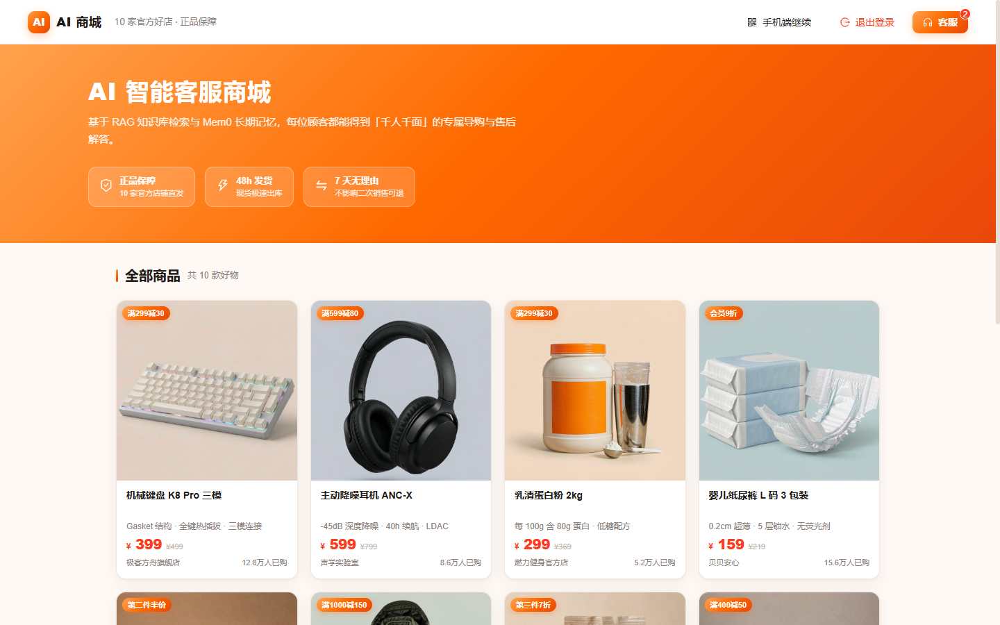

---

## 一、这个系统解决什么问题

传统电商客服有三个绕不开的痛点：

| 痛点 | 本项目的做法 |
|---|---|
| 顾客问来问去都是重复问题（尺码、参数、退换政策） | RAG 检索自有知识库，AI 直接作答，**答案有出处** |
| AI 不知道就容易瞎编，反而给商家惹麻烦 | 检索不到就**明确说不知道并转人工**，这是写进 prompt 的硬约束 |
| 顾客发图（破损、色差、订单截图），机器人看不懂 | 接入**图像识别**：事实类问题直接答，争议类**只描述所见、判定交人工** |

一句话概括设计取向：**AI 负责效率，人工负责责任。**

---

## 二、功能全景

### 2.1 C 端 · PC 商城

PC 端是完整的商城形态：首页商品墙、商品详情页、客服弹窗三部分。


首页展示 10 个商品，来自 **10 家不同店铺**、覆盖 10 个品类。每个商品在后端知识库中都有一份对应的商品说明书。

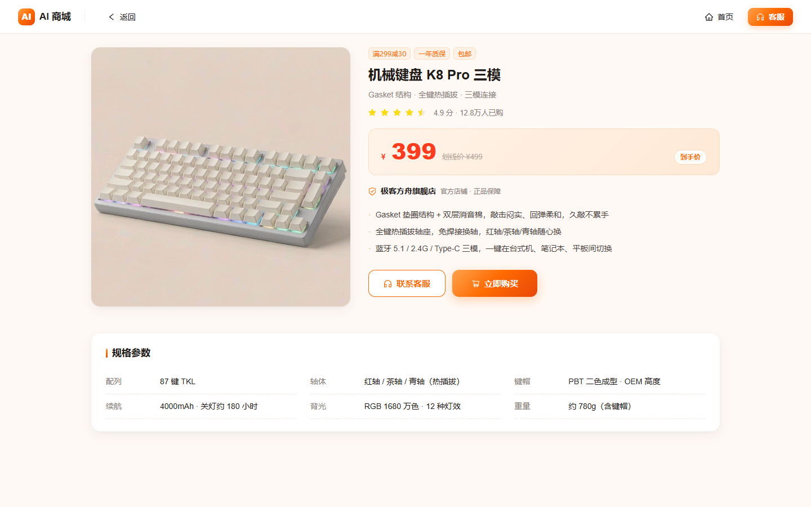

商品详情页包含卖点、规格参数表、店铺信息，右下角「联系客服」直接带上商品与店铺上下文进入会话。

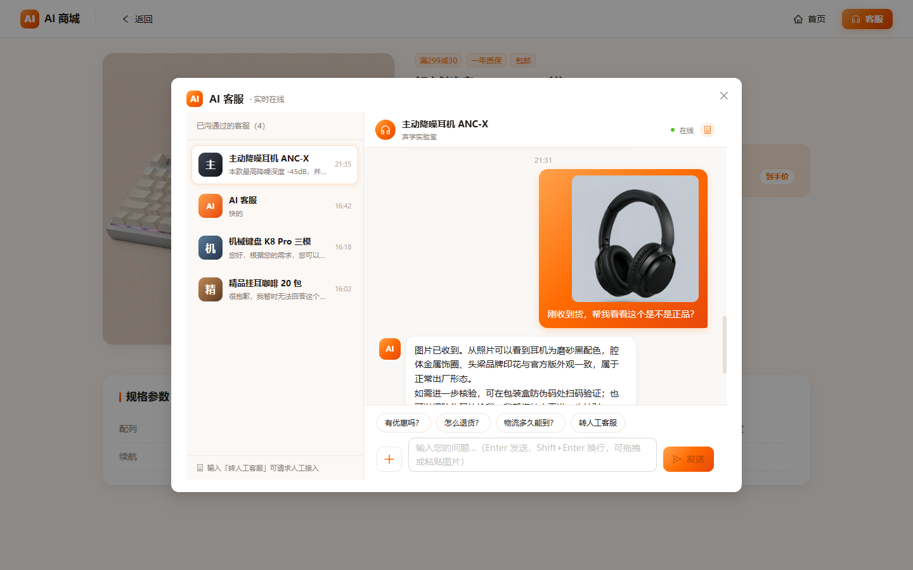

客服弹窗左侧是「已沟通过的客服」列表，右侧是对话。这里已经能看到**顾客发的图片消息**——顾客拍了耳机照片问是不是正品，AI 基于图片作答。

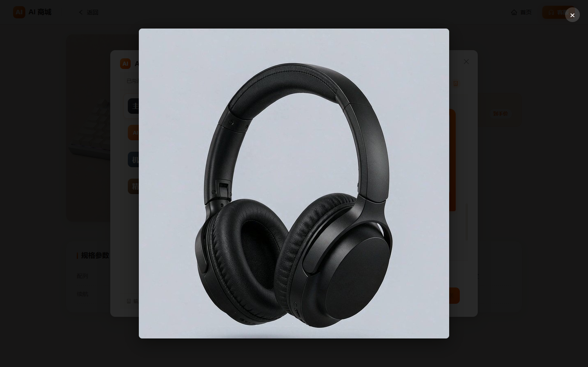

点击任意图片弹出全屏大图（移动端支持左右切换）。

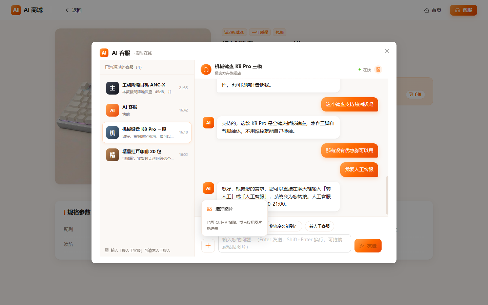

发图入口参考主流 AI 产品：输入框左侧「+」，点击弹出菜单，同时提示另外两种方式（`Ctrl+V` 粘贴、直接拖入）。

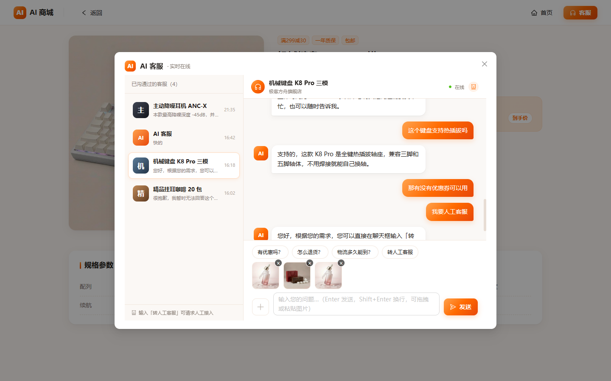

选中的图片压缩上传后排在**输入框上方**，右上角「×」可单独移除，**单条最多 3 张**，上传完成前发送按钮不可点。

---

### 2.2 C 端 · 移动端

移动端不是 PC 的简单缩放——导航结构、会话列表、输入区都是独立实现。

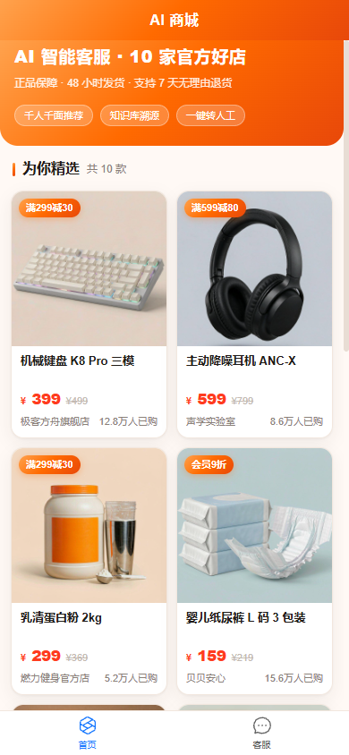

顶部只有品牌标题，底部是「首页 / 客服」两个 Tab。

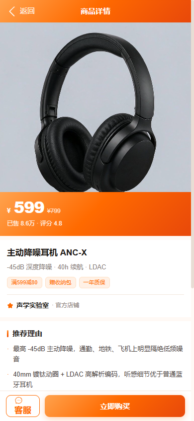

商品详情页，底部固定「客服 / 立即购买」操作条。

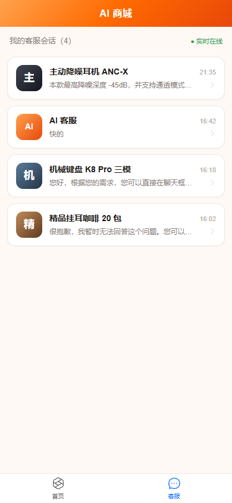

客服 Tab 的会话列表：**一条会话 = 一个客户 × 一家店铺 × 一个商品**。
同一顾客咨询了键盘、耳机、咖啡，就是三条独立会话——这是后面坐席台能按「店铺 · 客户」分流的前提。

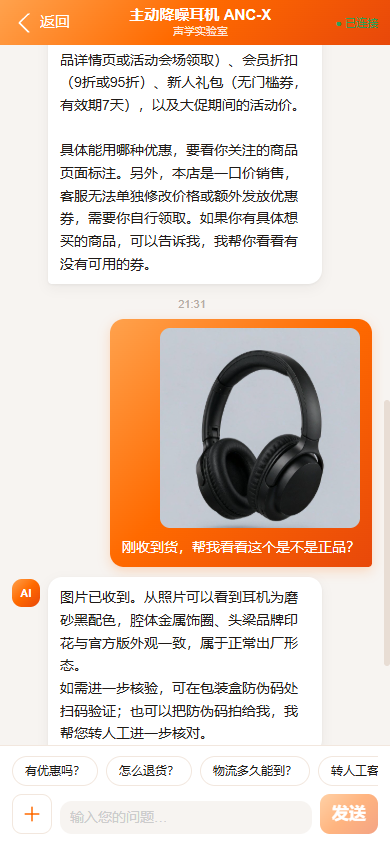

进入会话，历史消息从后端拉取。图中顾客发了耳机实拍图，AI 回复「图片已收到……」并给出客观描述。

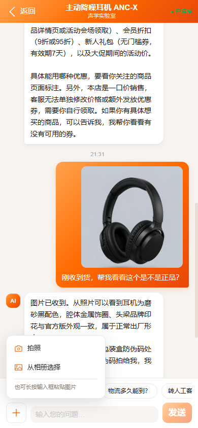

移动端「+」菜单会适配为「拍照 / 从相册选择」，另附长按粘贴提示。

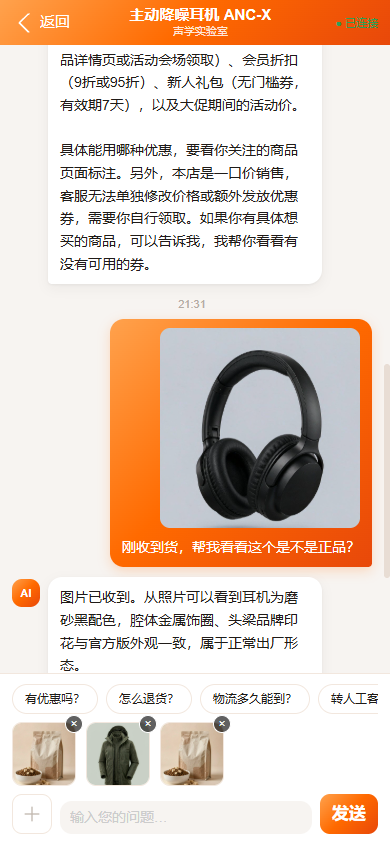

缩略图排在输入框上方，带删除「×」，满 3 张后「+」置灰。

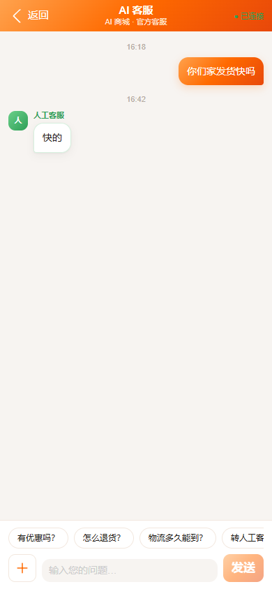

当会话转由人工接待时，顶部实时显示接待态，顾客侧同样能看到人工客服的回复与常用问题快捷入口。

---

### 2.3 B 端 · 坐席工作台

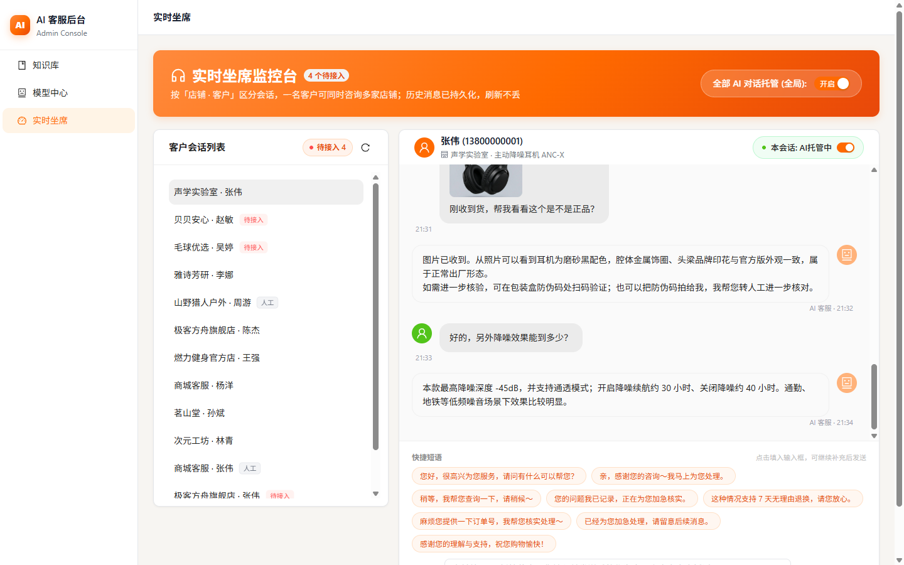

坐席台要解决的核心问题是：**在多个客户、多家店铺并行咨询时，坐席该先处理谁。**

- 左侧列表标题为「**店铺 · 客户**」，副标题是商品名与最新消息——避免把「一位客户的三个问题」误当成三个客户；
- 顶栏角标显示的是「**待接入 N**」而不是会话总数，没人工需求时整块隐藏；
- 会话条目带状态标签：红色「待接入」= 等人工、灰色「人工」= 已由人工接管（两者互斥）；
- 右上角是**全局 AI 托管总开关**，会话标题右侧是该会话的**独立开关**（会话级优先于全局）；
- 输入框上方是参考千牛做的**快捷短语**，点击只填入不直接发送，避免误发。

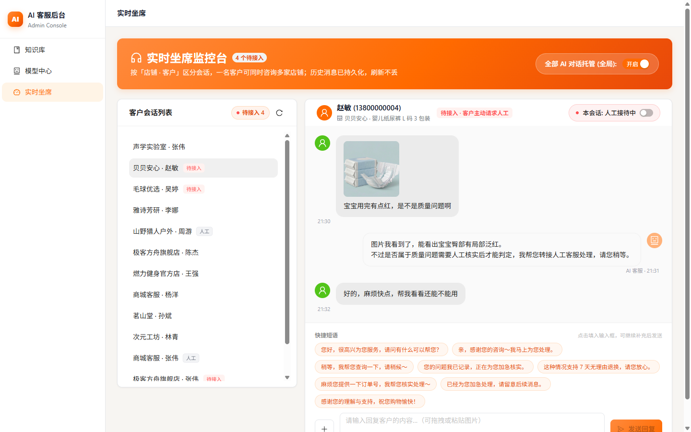

这正是一次典型的人工接入：顾客发来纸尿裤照片问「宝宝用完有点红，是不是质量问题」。

AI 的回复被限制在「描述所见 + 说明需要人工判定 + 转接人工」——**不替商家下质量结论**。随即：

- 会话头部出现红色「待接入 · 客户主动请求人工」；
- 该会话的 AI 托管被**自动关闭**（开关变红），AI 不会继续抢答；
- 该会话在左侧列表同步亮起红标，坐席一眼能看到待办。

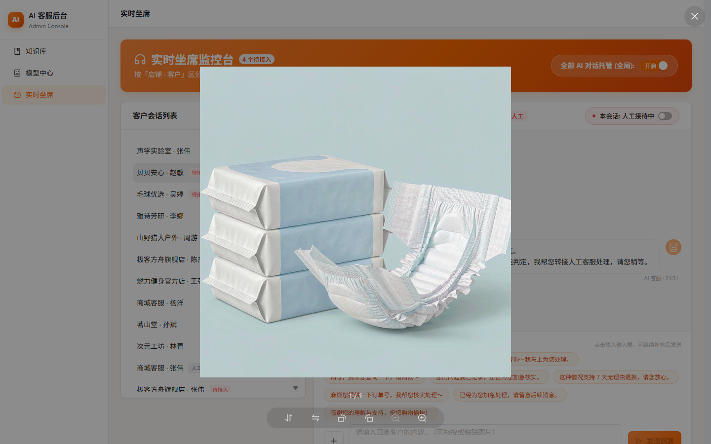

坐席侧同样可以点开大图查看细节，支持缩放与旋转。

---

## 三、系统架构

```
┌──────────────────────┐        ┌──────────────────────┐
│   C 端商城（顾客侧）  │        │  B 端坐席台（客服侧） │
│  Next.js 16 / React19│        │  Next.js 16 / antd 6  │
│  PC: antd v6         │        │  @ant-design/x        │
│  移动: antd-mobile v5 │        │                       │
└───────┬──────────────┘        └───────┬──────────────┘
        │  HTTP /api/chat               │  WebSocket /ws/agent
        │  WebSocket /ws/c/{user_id}    │  REST /api/conversations
        │                               │  REST /api/ai-custody
        ▼                               ▼
┌─────────────────────────────────────────────────────────┐
│                  FastAPI 后端（唯一中枢）                 │
│                                                          │
│  RAG 检索(SQLite FTS5)   Mem0 长期记忆   会话/消息持久化    │
│  图片上传与静态服务       人工接入判定       AI 托管仲裁       │
│  WebSocket 广播中心（坐席台 / 顾客端）                      │
└──────────────────────────┬──────────────────────────────┘
                           │ OpenAI 兼容协议
                           ▼
              ┌────────────────────────────┐
              │  Dots 模型网关（小红书）     │
              │  dots3-note-prev · 支持识图  │
              └────────────────────────────┘
```

**三个容器**：`backend`（FastAPI，宿主 8080）、`toc`（顾客端，3000）、`tob`（坐席台，3001）。
图片与数据库挂在 Docker 卷上，重启不丢。

---

## 四、几个关键技术点

### 4.1 会话模型：一条会话 = 客户 × 店铺 × 商品

这是整个系统里最影响上层体验的一个设计决定。

传统做法是「一个客户一条会话」，但真实电商里顾客会同时咨询多家店铺。如果按客户聚合，坐席看到的就是一锅粥；如果按「客户 + 商品」拆，又要处理一堆边界情况。

最终采用**复合主键**：`id = "{user_id}::{session_key}"`，其中 `session_key` 就是前端的本地会话 id（`store` 或 `product:{商品ID}`）。

好处是**前后端各自都能独立推算会话 ID，不需要先查库拿 ID**——前端本地会话、后端持久化记录、WebSocket 消息投递三处用的是同一套规则，天然对齐。

### 4.2 知识库问答：宁可说不会，也不编

RAG 检索链路做了四项针对性增强：

- **虚词黑名单**：过滤「的、了、吗」这类高频虚词，避免 FTS5 被噪声带偏；
- **标题加权 3.0**：命中文档标题的切片优先，「退货」这类词出现在文档名里很重要；
- **相关度下限 0.30**：低于阈值视为没搜到，不硬凑；
- **去掉 SQL `LIMIT`**：原先的截断会把主题长文档挤掉，改为全量召回后在应用层排序。

一旦检索为空，system prompt 会收紧回答边界：**寒暄可以正常回，实质咨询必须回「很抱歉，我暂时无法回答这个问题，您可以转接人工客服」，严禁用模型自身知识作答**。

### 4.3 图片消息与 AI 识图

图片链路上有四个容易漏的点，全都踩过：

1. **数据库只存相对路径**（`/uploads/chat/2026-09/xxx.jpg`），前端按各自域名拼接——换端口、换域名时历史图片不会集体失效；
2. **上传接口用可选鉴权**：顾客端带 JWT 正常识别身份，坐席台用口令登录、本就不持有 JWT，若强制鉴权会导致坐席发图必然 401；
3. **广播体必须同步携带 `images`**：`chat_stream`、`agent_message`、`agent_reply`、`handoff_request` 四条消息漏任何一条，就会出现「消息到了但图裂开」；
4. **发给模型前图片转 base64 内联**：模型网关在公网，访问不到我们 `localhost` 上的图片。

**识图的能力边界是写进 prompt 的硬规则**，与项目「严禁编造」的高压线一致：

| 问题类型 | 例子 | AI 的处理 |
|---|---|---|
| 事实类 | 这是什么颜色？图上写了什么？怎么用？ | 可以直接回答 |
| 争议类 | 这是质量问题吗？能退吗？是谁的责任？ | **只客观描述所见 + 引用知识库条款，判定交人工** |
| 无法辨认 | 图片模糊、角度不对 | 明说看不清，**不猜** |

### 4.4 人工接入（handoff）

两个触发源，都算一次「请求人工接入」：

- **顾客主动**：消息里出现「转人工」等意图（关键词刻意不含裸词「人工」，避免「人工智能」「人工湖」误触发）；
- **AI 兜底**：AI 回复了那句「暂时无法回答，请转接人工」。

命中后做三件事：标记会话待接入、**自动关闭该会话的 AI 托管**、广播给坐席台弹告警。
待接入状态**持久化在数据库**，所以坐席刷新页面、甚至后端重启，红标都不会丢；直到人工回复后才清除。

### 4.5 AI 托管：两级开关，真正生效

坐席台可以关掉 AI 托管，让某条会话（或全部会话）改由人工承接：

- **两级仲裁**：全局开关存 `settings` 表，会话级覆盖存 `conversations.ai_managed`，**会话级优先**；
- **唯一仲裁入口**：`is_ai_managed(db, conv_id)`，避免多处各写一套判定导致优先级走偏；
- **关闭后 AI 不再生成回复**——顾客消息照常落库并推送到坐席台，但不会再有 AI 插话；
- 坐席回复时再次显式关闭该会话的托管，防止 AI 重新抢答。

---

## 五、工程实现上值得一提的几处

| 问题 | 解法 |
|---|---|
| SQLite 没有迁移框架，加字段怎么办 | `ensure_schema()` 在启动时**幂等补列**，老库自动补齐，失败不阻断启动 |
| 持久化失败不能打断聊天主链路 | `conversation_store` 的写函数**永不抛异常**，失败只降级为日志——这是刻意设计 |
| 顾客换设备后聊天记录消失 | 后端为真源，顾客端登录后从 `/api/conversations` 反向同步；本地独有、尚未发消息的会话予以保留 |
| 多坐席浏览器状态不一致 | 托管开关变更通过 WebSocket 广播 `ai_custody`，各端实时同步 |
| 顾客端整站白屏（曾发生） | 根因是引用了 `antd-mobile-icons` 中**不存在**的图标导出，导致客户端整包崩溃；症状是 SSR 返回 200 但页面空白 |

---

## 六、快速启动

```bash
# 1. 准备模型配置（根目录 .env，已被 gitignore）
#    XIAO_HONG_SHU_API_KEY=your-key

# 2. 启动三个容器
docker compose up -d
#    backend → http://localhost:8080/docs
#    toc     → http://localhost:3000
#    tob     → http://localhost:3001

# 3. 灌入演示知识库（16 篇商品说明书与政策文档，幂等可重复执行）
docker compose exec -T backend python scripts/seed_kb.py

# 4. 可选：注入一批演示会话（多客户 / 多店铺 / 含图片与待接入状态，幂等）
docker compose exec -T backend python scripts/seed_demo.py
```

**演示账号**

| 端 | 入口 | 凭据 |
|---|---|---|
| C 端商城 | `localhost:3000` | `13800000001` ~ `13800000010`，密码 `123456` |
| B 端坐席台 | `localhost:3001` | 口令 `admin123` |

---

## 七、目录结构

```
aiservice/
├── backend/                  FastAPI 服务
│   ├── ai_engine.py          LLM 调用（含图文消息构造与识图规则）
│   ├── rag.py                FTS5 中文检索（虚词过滤 / 标题加权 / 相关度下限）
│   ├── handoff.py            人工接入意图判定
│   ├── conversation_store.py 会话与消息读写（永不抛异常）
│   ├── chat_images.py        图片落盘与 base64 转换
│   ├── models.py / database.py  数据模型与幂等补列
│   ├── routers/              chat / ws / conversation / custody / upload / kb / auth
│   └── scripts/              seed_kb.py（知识库）、seed_demo.py（演示会话）
├── toc/                      顾客端（Next.js，PC + 移动双端）
├── tob/                      坐席工作台（Next.js + @ant-design/x）
├── docs/                     设计与过程文档（本文件、架构、进度）
└── docker-compose.yml
```

---

## 八、已知限制与后续计划

**当前明确未做的（上线前需要补齐）**

- 图片**无内容审核与病毒扫描**，上传无频率限制与容量上限，孤儿图片不自动清理；
- `/api/conversations`、`/api/ai-custody` 等坐席侧接口**未做鉴权**，仅靠口令进入前端；
- 模型中心页面（`tob` 的「模型中心」）是**静态展示**，切换不生效——真正的模型配置只认环境变量；
- 知识库与商品数据均为**演示用占位内容**，需替换为真实业务数据；
- 坐席快捷短语目前是内置常量，可挪到后端配置让坐席自行维护。

**可以继续做的**

- 坐席侧接入客服分配与排队（当前所有坐席看到同一份列表）；
- 会话标签、备注与工单流转；
- 图片消息接入内容审核后再落库。

---

<sub>本文档截图均为系统真实运行截图（Docker 三容器环境），由浏览器自动化采集，未经过设计稿修饰。</sub>
